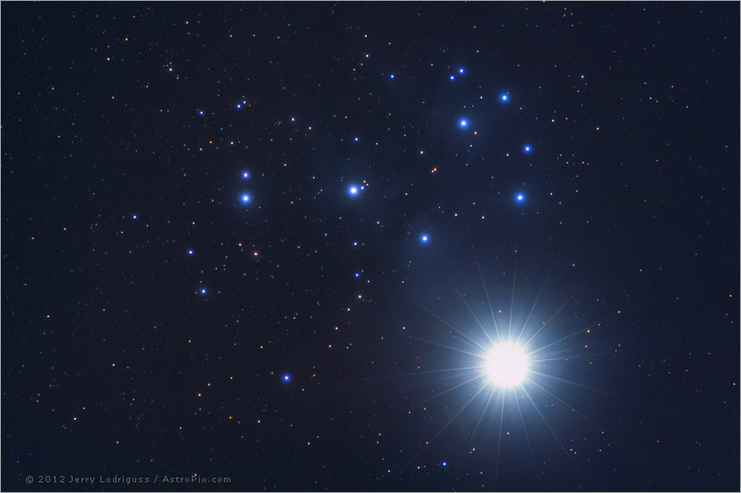

# Articulos y vídeos
## Videos
* [Polar alignment with ShapCap](https://www.youtube.com/watch?v=_pZ77zqbsAE)
* [Polar Drift Alignment with PHD2](https://www.youtube.com/watch?v=_pZ77zqbsAE)
* [APT Tutorials](https://www.youtube.com/playlist?list=PLjR-rBiLuHlVrdByqERM2SV_DISOA-QI5)
* [Astrophotography Tutorial](https://www.youtube.com/watch?v=jqZREcJ54tY)

## Referencias
* [Cometografía](https://cometografia.es)

# Enlaces de interés
## Proveedores
* [AstroShop](https://www.astroshop.es/)
* [TelescopioMania](https://www.telescopiomania.com)

## Hardware
* [SkyWatcher](http://skywatcher.com)
* [ZWO](https://astronomy-imaging-camera.com)
* [QHYCCD](https://www.qhyccd.com/)
* [The Shoestring Astronomy](http://www.store.shoestringastronomy.com/products_ds.htm)

## Software
* [Astro Photography Tool](https://astrobackyard.com/astro-photography-tool/)
* [BackyardEOS / BackyardNIKON](https://www.otelescope.com/store/category/2-backyardeos/)
* [PHD2 Guiding](https://openphdguiding.org)
* [SharpCap](https://www.sharpcap.co.uk)
* [Stellarium](https://stellarium.org/es/)
* [SExtractor](http://www.astromatic.net/software/sextractor)
* [Deep Sky Stacker](http://deepskystacker.free.fr/english/index.html)

# Código fuente
* [ASCOM](https://github.com/rbarbera/ASCOMPlatform)
* [PHD2](https://github.com/rbarbera/phd2)
* [Open SynScan](https://github.com/rbarbera/Open-Synscan)
* [SkyWatcher WiFi](https://github.com/rbarbera/SkyWatcherWiFi)
* [SExtractor](https://github.com/rbarbera/sextractor)
